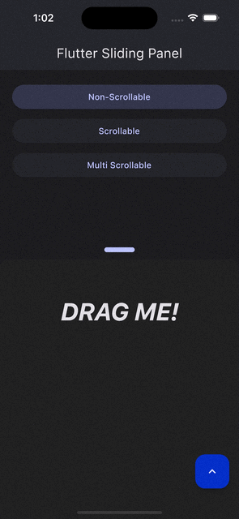

<!--
This README describes the package. If you publish this package to pub.dev,
this README's contents appear on the landing page for your package.

For information about how to write a good package README, see the guide for
[writing package pages](https://dart.dev/guides/libraries/writing-package-pages).

For general information about developing packages, see the Dart guide for
[creating packages](https://dart.dev/guides/libraries/create-library-packages)
and the Flutter guide for
[developing packages and plugins](https://flutter.dev/developing-packages).
-->

# Flutter Sliding Panel

[](https://codecov.io/gh/dhiyaaulauliyaa/flutter_sliding_panel)
[](https://pub.dev/packages/flutter_sliding_panel)
[](https://github.com/dhiyaaulauliyaa/flutter_sliding_panel/blob/master/LICENSE)

Explore the capabilities of the Flutter Sliding Panel, a versatile and user-friendly widget that enables smooth sliding and seamless snapping behavior. This widget empowers you to effortlessly create slidable panels that smoothly snap to their designated anchors or expanded positions.

The standout feature of this panel is its seamless support for natural gestures when its child has scrollable content. Experience the fluidity of these gestures as the scrollview is navigated, and watch as the panel intelligently determines whether it should be anchored or not. To witness the panel's behavior during scrollview interactions, visit the [sample web page](https://dhiyaaulauliyaa.github.io/flutter_sliding_panel/#/).

## [🔬 Test The Package 🔬](https://dhiyaaulauliyaa.github.io/flutter_sliding_panel/#/)

- Access the example web page [here](https://dhiyaaulauliyaa.github.io/flutter_sliding_panel/#/)
- The homepage features a simple example of the Sliding Panel widget.
- Test how the panel behaves with a scrollview child by pressing the `Scrollable` button.
- Experience how the panel handles multiple scrollview children by pressing the `Multi Scrollable` button.

## Features

`🛝 A Slidable Panel`<br>
`👩🏻‍🎨 Extensive Appearance Customization `<br>
`🏎️ Smooth & Customizable Animation`<br>
`🕹️ Control Panel Position Programmatically`<br>
`♻️ Seamless Integration with RefreshIndicator`<br>
`🧮 Designate Snapping Positions`<br>

## Showcases

|                                 Non-Scrollable Child                                  |                                       Show Refresh Indicator                                        |
| :-----------------------------------------------------------------------------------: | :-------------------------------------------------------------------------------------------------: |
|  |  |

<br>

|                                    Single Scrollable Child                                    |                                   Multi Scrollable Child                                    |
| :-------------------------------------------------------------------------------------------: | :-----------------------------------------------------------------------------------------: |
|  |  |

## Usage

Start using the Sliding Panel in your Flutter project with these simple steps:

### Add to pubspec.yaml

```cli
dart pub add flutter_sliding_panel
```

### Import the package

```dart
import 'package:flutter_sliding_panel/flutter_sliding_panel.dart';
```

### Use the widget and have fun 🎉

You're all set to start using the Sliding Panel in your project. See the examples [below](##-Examples) to get started quickly.

## Feature Details

### 🛝 A Slidable Panel 🛝

Easily create panels that are slidable, reminiscent of bottom sheets, and have the capability to slide and snap to designated positions.

### 👩🏻‍🎨 Extensive Appearance Customization 👩🏻‍🎨

Tailor the panel's appearance to suit your interface specification by defining `BoxDecoration` for the decoration parameters.

### 🏎️ Smooth & Customizable Animation 🏎️

Experience smooth animations, carefully designed for performance. Customize animation curves and durations with the `SlidingPanelConfig`.

### 🕹️ Control Panel Position Programmatically 🕹️

Programmatically control the panel's position using `SlidingPanelController`. Use its `anchor` or `expand` methods to set the panel's state.

### ♻️ Seamless Integration with RefreshIndicator ♻️

The panel seamlessly integrates with a refresher, allowing for the reloading of content with a natural gesture and providing an enhanced user experience.

### 🧮 Designate Snapping Positions 🧮

Specify the panel's snapping positions using `SlidingPanelConfig`. Define the `anchor` and `expand` positions as per your requirements.

```dart
SlidingPanelConfig(
    anchorPosition: MediaQuery.of(context).size.height / 2,
    expandPosition: MediaQuery.of(context).size.height - 200,
)
```

- The anchor position is when the panel is closed (lowered).
- The expanded position is when the panel is fully open.
- Ensure that the anchor position is lower than the expanded position.
- Positions are calculated from the bottom to the top of the viewport.

## Examples

### SlidingPanel with Non-Scrollable Child

This is the most basic type of sliding panel. Simply instantiate SlidingPanel and pass every params needed.

```dart
SlidingPanel(
    controller: SlidingPanelController(),
    config: SlidingPanelConfig(
        anchorPosition: MediaQuery.of(context).size.height / 2,
        expandPosition: MediaQuery.of(context).size.height - 200,
    ),
    panelContent: Text(
        '\nDRAG ME!',
        textAlign: TextAlign.center,
        style: TextStyle(
            fontSize: 40,
            letterSpacing: -1,
            fontWeight: FontWeight.bold,
            fontStyle: FontStyle.italic,
            color: Theme.of(context).colorScheme.onSurface,
        ),
    ),
);
```

### SlidingPanel with a Single Scrollable Child

In this example, the panel's content is a scrollview. Use `SlidingPanel.scrollableContent()` when creating the widget. This provides a `panelContentBuilder` that includes a `ScrollController` and `ScrollPhysics` to be used with the scrollview. These controllers and physics settings enable a natural scrolling experience when the user interacts with the scrollview.

```dart
SlidingPanel.scrollableContent(
    controller: SlidingPanelController(),
    config: SlidingPanelConfig(
        anchorPosition: MediaQuery.of(context).size.height / 2,
        expandPosition: MediaQuery.of(context).size.height - 200,
    ),
    panelContentBuilder: (controller, physics) => ListView.builder(
        controller: controller,
        physics: physics,
        itemBuilder: (context, index) => Container(
            height: 50,
            alignment: Alignment.center,
            child: Text('$index'),
        ),
    ),

);
```

### SlidingPanel with Multi Scrollable Child Example

This example features a sliding panel with multiple scrollviews as its content. Use `SlidingPanel.multiScrollableContent()` to create the widget. Provide the number of scrollable children using the `scrollableChildCount` parameter. This provides a `panelContentBuilder` with `ScrollController` and `ScrollPhysics` settings for each scrollview. The number of controllers and physics settings corresponds to the specified `scrollableChildCount`, allowing for a natural scrolling experience when interacting with the scrollviews.

```dart
SlidingPanel.multiScrollableContent(
    controller: SlidingPanelController(),
    scrollableChildCount: 2,
    config: SlidingPanelConfig(
        anchorPosition: MediaQuery.of(context).size.height / 2,
        expandPosition: MediaQuery.of(context).size.height - 200,
    ),
    panelContentBuilder: (controller, physics) => TabBarView(
        controller: tabController,
        children: List.generate(
            2,
            (index) => MultiScrollableChildTab(
                controller: controller[index],
                physics: physics[index],
                tabIndex: index,
            ),
        ),
    ),
);
```

### Show Refresh Indicator if Panel is Overly Scrolled

To display a refresh indicator, pass `SlidingPanelRefresherConfig` to the `dragToRefreshConfig` parameter. The refresh indicator appears when the panel is over-scrolled while in the anchored state.

```dart
SlidingPanel(
    controller: SlidingPanelController(),
    config: SlidingPanelConfig(
        anchorPosition: MediaQuery.of(context).size.height / 2,
        expandPosition: MediaQuery.of(context).size.height - 200,
    ),
    dragToRefreshConfig: SlidingPanelRefresherConfig(
        onRefresh: () async {
            // TODO: Implement on refresh
        },
    ),
    panelContent: Text(
        '\nDRAG ME!',
        textAlign: TextAlign.center,
        style: TextStyle(
            fontSize: 40,
            letterSpacing: -1,
            fontWeight: FontWeight.bold,
            fontStyle: FontStyle.italic,
            color: Theme.of(context).colorScheme.onSurface,
        ),
    ),
);
```

## 😇 Contribute

We are always thrilled to welcome anyone who wishes to enhance this package. Your contributions are greatly appreciated! 🙇‍♂️

## 💡 Issue / Feature Requests

If you have specific features in mind, don't hesitate to let me know. Please open an issue to discuss your feature requests, and I'll be more than happy to consider them and collaborate towards making this package even better. 🙏
